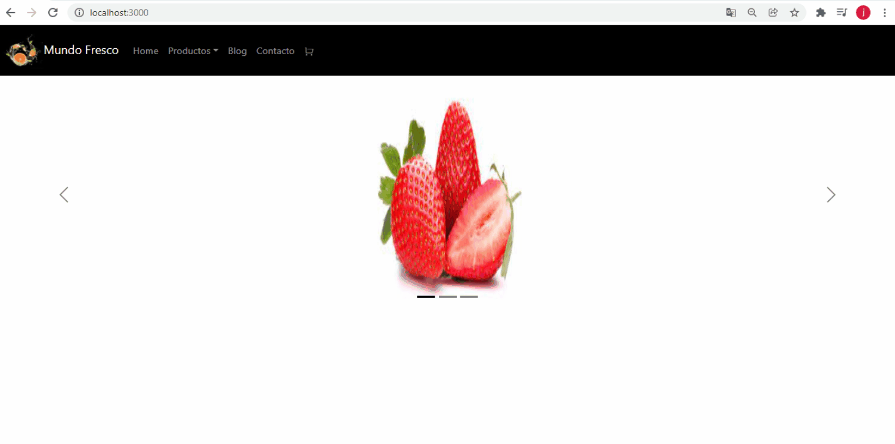

# Mundo Fresco
​
Mundo Fresco es un e-commerce de venta de frutas y verduras.
​
Contiene:
​
- Categorias por funcionalidad
- Posibilidad de compra desde listado de items y desde el detalle del item(desarrollando)
- Selección de cantidad de productos con control al stock
- Carrito de compras (desarrollando)
- Landing page


​
## Instalación
​
1. Forkeá y cloná el repositorio
​
2. Parado en la raíz del proyecto corré el comando 
​
   ```
   npm install
   ```
​
    para instalar todas las dependecias del proyecto
​
3. Ejecuta en el directorio del proyecto 
​
   ```
   yarn start
   ```
​
   para inicializar el proyecto, que se visualizará en http://localhost:3000 o http://IP_PC:3000 para la conexión externa
​
​
​
## Dependencias
​
Uso de React Boostrap para el estilo de la pagina
​
Uso de React Router Dom para la navegación
​
Uso de React Icons para todo el proyecto

Uso de React Yarn para la ejecución del proyecto
​
## Aplicación en funcionamiento
​

​
### Autor
​
Juan Moreno
​
2021 - Curso de React en CoderHouse